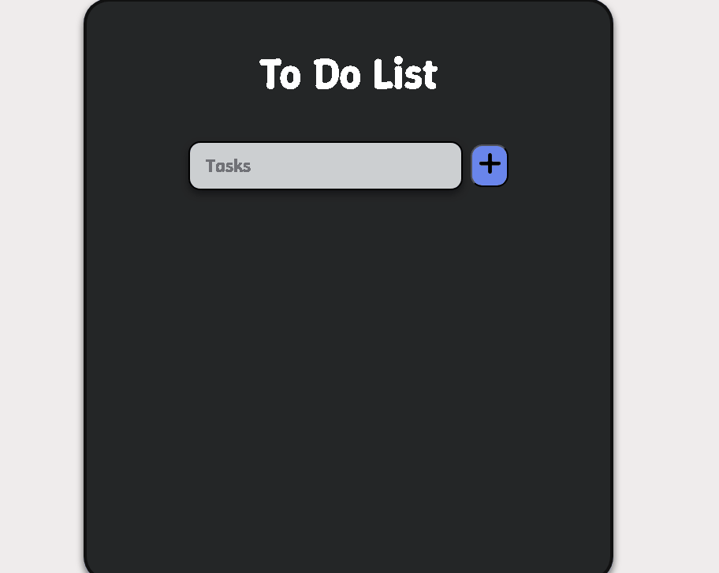
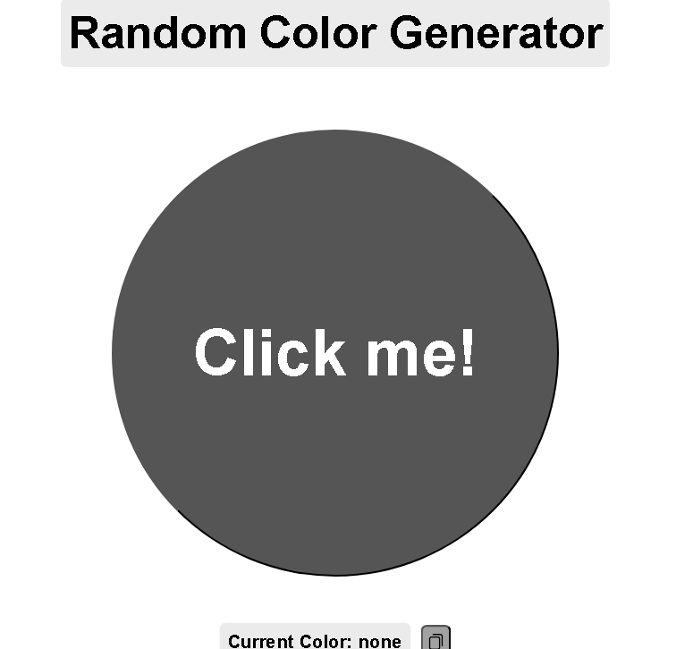
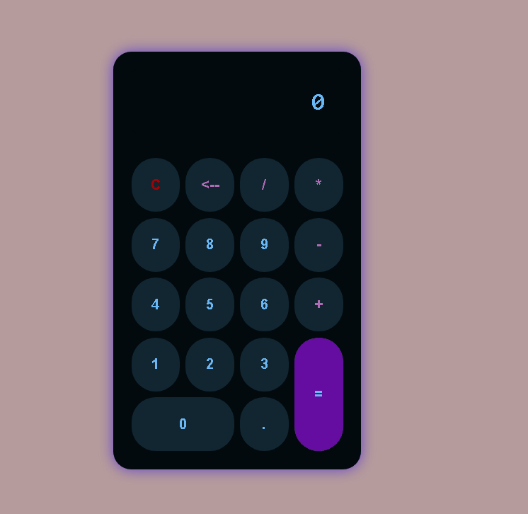
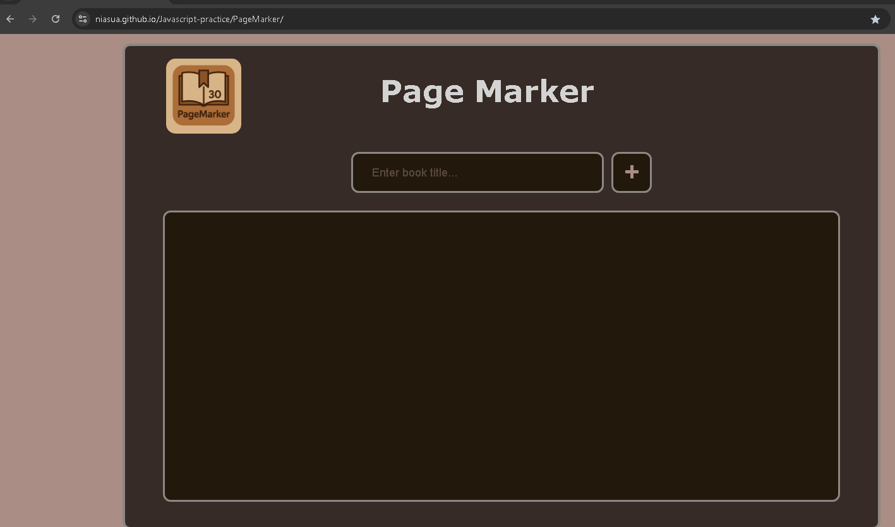

# Javascript Practice Projects

This repository contains a collection of small JavaScript projects that I have built to practice various aspects of JavaScript and web development. These projects demonstrate the use of DOM manipulation, event handling, and basic web functionality.

## Projects

- [ToDo List](#to-do-list)
- [Color Changer](#color-changer)
- [Calculator](#calculator)
- [Page Marker](#page-marker)

---

### ToDo List

A simple To-Do List web application built with JavaScript. It allows you to add tasks, mark them as completed, and delete them. Tasks are stored temporarily in the app and are visually updated when marked as completed.

#### Features:
- Add new tasks
- Delete tasks
- Mark tasks as completed

#### Demo:

### Try it!

[Try toDoList](https://niasua.github.io/Javascript-practice/toDoList/)

---

### Color Changer

A small web app that lets you change the background color of the page by clicking on different color buttons. It is designed to practice working with DOM events and color manipulation in JavaScript.

#### Features:
- Change background color with buttons
- Simple design

#### Demo:

### Try it!

[Try colorChanger](https://niasua.github.io/Javascript-practice/colorChanger/)

---

### Calculadora

A basic calculator built with HTML, CSS, and JavaScript. It supports basic arithmetic operations like addition, subtraction, multiplication, and division, along with a clear and backspace function.

#### Features:
- Addition, subtraction, multiplication, division
- Clear button (C) and backspace button
- Responsive design

#### Demo:

### Try it!

[Try calculadora](https://niasua.github.io/Javascript-practice/calculadora/)

---

### Page Marker

This project allows users to mark the page number of books they are reading, helping them track where they left off. It is designed for people who frequently read physical books and want an easy way to record their progress.

#### Features:
- Mark the current page of a book
- Keep track of where you left off in your reading
- Simple and intuitive design
- Saves on local storage

#### Demo:

### Try it!

[Try PageMarker](https://niasua.github.io/Javascript-practice/PageMarker/)

---

